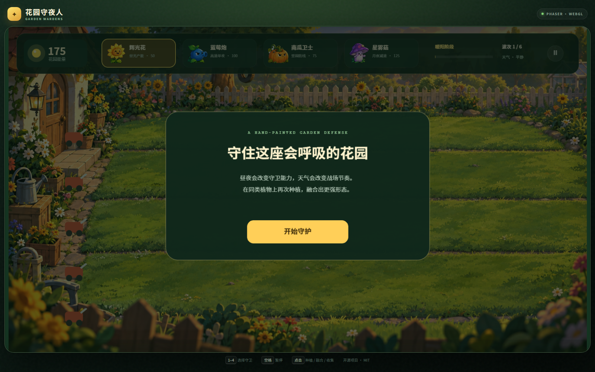

# Garden Wardens · 花园守夜人

[中文](README.md) · **English**

An original hand-painted WebGL garden-defense game built with Phaser 3 and Vite, playable on desktop and mobile browsers.

**[Play online →](https://synapshift.github.io/garden-wardens/)** · No installation required



## Features

- Five garden lanes, nine planting columns, and six progressively harder waves
- Four original plant wardens and four original garden invaders
- Day/night resonance, three-level plant fusion, dynamic weather, and energy recovery
- Energy-powered tools for auto-collection, random garden events, and global weapon upgrades
- A dynamic threat system that scales with waves and formation strength
- Hand-painted transparent character sprites and a dedicated battlefield background
- Breathing, swaying, planting, recoil, and walking animations
- Projectile trails, burst particles, hit flashes, slow effects, and camera shake
- Synthesized Web Audio feedback with no additional audio files
- Keyboard, mouse, and touch controls

## Controls

- Select a warden card at the top, or press `1`–`4`
- Click or tap a lawn tile to plant
- Plant the same type on an occupied tile to fuse it to level 2 or 3
- Click or tap glowing energy orbs to collect them
- Press Space or use the top-right button to pause

## Original Mechanics

**Day/night resonance:** Day and night alternate every 32 seconds. Glowblooms produce energy faster in daylight, while Starshrooms cast significantly faster under moonlight.

**Plant fusion:** Wardens of the same type can fuse in place, restoring health and increasing maximum health. Level-three plants also unlock enhanced abilities.

**Dynamic weather:** Sunshowers generate extra energy, while tailwinds increase projectile speed, changing the rhythm of every formation.

## Run Locally

Node.js 20 or newer is required.

```bash
npm install
npm run dev
```

Production build:

```bash
npm run build
npm run preview
```

## Art Asset Pipeline

Character source artwork is stored in `assets/source/`. Process it into game-ready transparent sprites with:

```bash
python tools/process_assets.py
```

Python, Pillow, and NumPy are required. Processed assets are written to `public/assets/sprites/`.

## Project Structure

```text
├── .github/workflows/       # GitHub Pages deployment
├── assets/source/           # Character source artwork
├── public/assets/           # Battlefield and transparent sprites
├── src/main.js              # Phaser scene, combat, and effects
├── tools/process_assets.py  # Asset processing script
├── index.html
├── styles.css
└── LICENSE
```

## License

The code is released under the [MIT License](LICENSE). The game title, characters, and current artwork were designed as an original project; no code or assets from other games are included.

Issues and pull requests are welcome.
